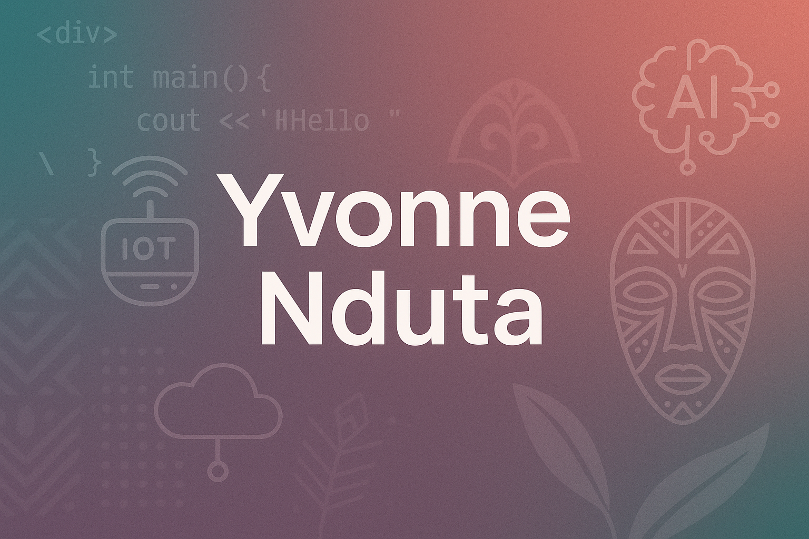

# 👋🏾 Hi, I’m Yvonne Nduta Wangui

Welcome to my corner of GitHub!

I'm a Software Engineer based in Nairobi, Kenya, with 7+ years of experience building scalable systems, working with connected devices, and turning data into meaningful insights. I care deeply about creating tools and experiences that are reliable, thoughtful, and impactful — especially in communities that need them most.

## 🛠 What I Work On

- Backend systems in **.NET (C#)** & **PostgreSQL**
- IoT platforms — managing devices, data pipelines, and OTA updates
- Cloud architecture on **AWS**, and automation with tools like **Hangfire** and **GitHub Actions**
- AI and wellness tech — combining logic and compassion

## 💼 Where I’ve Been

- 🏭 **Burn Manufacturing** – Building IoT and analytics platforms for clean energy across Africa  
- 💻 **Microsoft (EMEA)** – Delivered cloud-first enterprise solutions across diverse markets  
- 🌱 **Creare Africa** & **Netwookie Ltd** – Full-stack innovation in fintech and impact spaces

## 🚀 Currently Exploring

- **Next.js** for building sleek, modern web UIs  
- **Agent AI** for smart automation and decision flows  
- Tools that combine tech + wellness + creativity (think n8n, LangChain, and Canva)

## 🌐 On the Side

- Founder of [Tsuki Wellness](https://tsukiwellness.com) – a digital space for holistic wellness  
- Creator of **JobAura** – an AI-powered job search assistant (in progress!)  
- Forever curious about human-centered systems, design, and growth

## 📬 Let’s Connect

- [LinkedIn](https://linkedin.com/in/yvonnenduta)  
- yvonnendutaw@gmail.com  

---

> _“Build intentionally. Optimize continuously. Deliver with impact.”_
